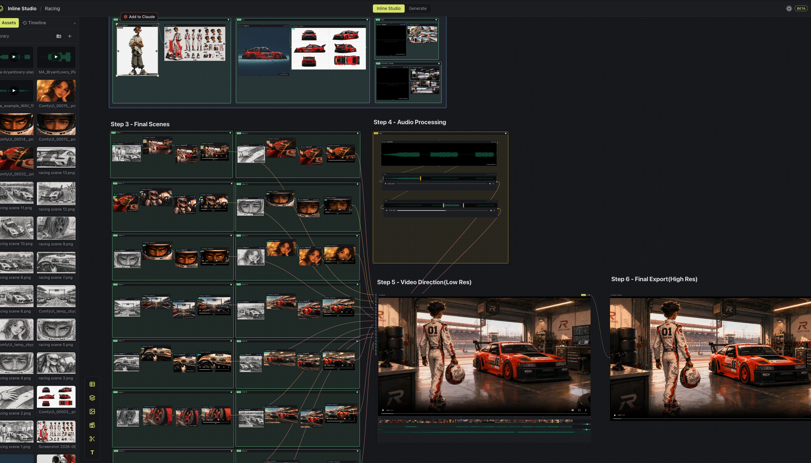
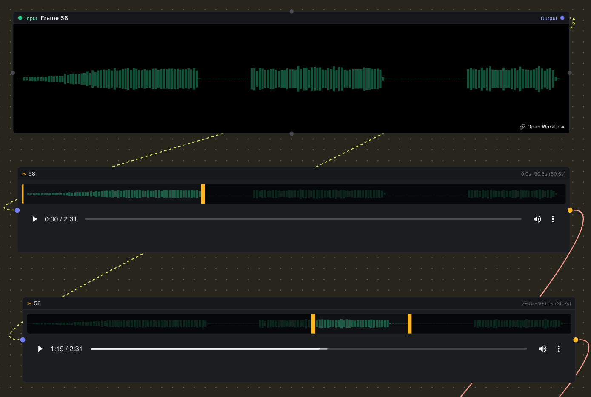
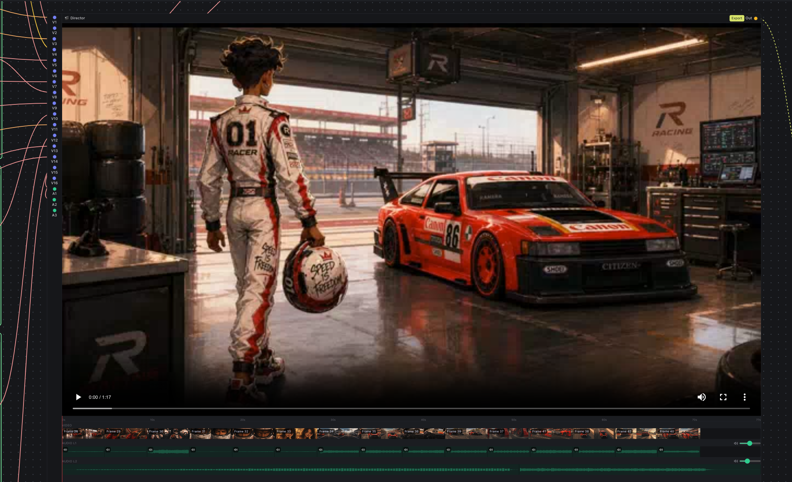

# Inline Studio

**An experimentation layer for visual artists. Build, iterate, and share generative pipelines on your own [ComfyUI](https://github.com/comfyanonymous/ComfyUI).**

[](https://discord.gg/cSUS88VdY9)
[](LICENSE)

ComfyUI is the most capable generative engine going: image, video, audio, LLM, every new model lands there first. But generating is the easy part. The work that matters is what comes after: exploring options, keeping what's good, and shaping a repeatable process out of it. Inline Studio is the layer where that happens. It gives visual artists a free-form node canvas to experiment on, holds every version that worked, and grows a single render into a pipeline you can iterate on and share, while your own ComfyUI does the rendering behind each shot.



## What's new

**Video Director node:** a timeline-in-a-node that combines your rendered frames into a single cut.
Wire unlimited frame/preview outputs into it to build the video track, layer audio on top (L1 is the
videos' own audio, L2 is your own music/VO) with per-input and per-layer volume, scrub the in-node
preview, and export the combined high-res video.

**Edit Video/Audio node:** a simple trim node. Drop in a video or audio clip, drag the in/out
handles over its filmstrip/waveform, and pass just the trimmed segment downstream to the director or
preview node.

|               Edit Video/Audio node                |               Video Director node                |
| :------------------------------------------------: | :----------------------------------------------: |
|  |  |

---

[**New here? Follow our Animated Short Film with LTX 2.3 and GPT Image Generation tutorial →**](https://inlinestudio.art/projects/circuit-race)

## Pipelines, not workflows

A **workflow is not a project. It's one layer of many.**

One ComfyUI workflow makes one thing well. A real project is dozens of them, layered and wired into a pipeline. Inline Studio is where you compose that: build a workflow, turn it into a shot, feed it into the next, and keep every version that works. The canvas holds the whole pipeline, not just the last render.

```
Workflow  →  Shot  →  Layer  →  Pipeline
```

---

## Export the entire pipeline

A project is a single portable `.inlinestudio` folder you can move, back up, or hand to a collaborator.

**Export bundles the whole pipeline, not just the final render.** From the home screen, **Export** zips the project into one archive. Import it on the other side and you get everything back: the inputs (every imported asset), the outputs (all the generated takes), and the ComfyUI workflows that turned one into the other. Whoever opens it can re-run the pipeline exactly and keep iterating, with nothing left dangling on your machine.

---

## How it feels to use

Everything happens on a **node canvas**. Think of it as a mood board that can actually generate.

- **Drop an asset** onto the canvas to start a frame. Drop several and the frame becomes a little carousel; star the one you want as the hero.
- **Preview a frame's output**, page through its takes, and pick the keeper.
- **Chain frames together**: wire one frame's output into the next frame's input, and the result you chose flows straight through. Refine a shot, then feed it forward. Regenerate the source and everything downstream follows.
- **Arrange freely** with layers, text notes, and connections, the way you'd lay out a board in Figma or Miro. Marquee-select, copy/paste, delete, and undo/redo all work the way your hands expect.

When it's time to generate, the **Generate** tab opens your own ComfyUI right inside the app. Inline Studio hands it the frame's inputs, wires them into the workflow, and pulls the finished renders back in as takes. The full node graph is always one click away when you want it.

---

## A built-in assistant (Claude)

Inline Studio ships with an AI assistant powered by **Claude** that works alongside you on the canvas. Connect your own [Anthropic API key](https://console.anthropic.com/settings/keys) — it's stored encrypted on your machine and never sent anywhere but Anthropic — and open the assistant from the Claude icon in the header.

---

## Bring your own ComfyUI

Inline Studio doesn't bundle or manage ComfyUI; you run it, wherever you like, and point Inline Studio at it.

- **Running locally with a GPU?** Start ComfyUI with `--enable-cors-header` and paste its address into the Generate tab.
- **No GPU?** Spin up ComfyUI on a cloud GPU (the app walks you through deploying it on [RunPod](https://runpod.io)) and paste the public URL. Any reachable ComfyUI works.

Your media, your models, your machine. ComfyUI does the rendering. Inline Studio gives the work a shape you can iterate and share.

---

## Install

Grab a prebuilt installer from the [latest release](../../releases/latest) and open it:

- **macOS:** download the `.dmg` for your chip — `arm64` for Apple Silicon (M1/M2/M3…), `x64` for Intel Macs — open it, and drag Inline Studio into Applications.
- **Windows:** download the `-setup.exe` and run it.
- **Linux:** download the `.AppImage`, make it executable (`chmod +x Inline Studio*.AppImage`), and run it.

The builds are currently unsigned, so on first launch your system may warn about an unidentified developer:

- **macOS:** right-click the app and choose Open, then Open again. If it says the app is "damaged", run `xattr -dr com.apple.quarantine /Applications/Inline Studio.app`.
- **Windows:** on the SmartScreen prompt, click "More info" then "Run anyway".

To actually generate, you'll also need a ComfyUI instance to connect to (see [Bring your own ComfyUI](#bring-your-own-comfyui)). The canvas and planning work without it.

---

## Getting started

Prefer to run from source? You'll need [Node.js](https://nodejs.org) 20.11+ (22 recommended).

```bash
git clone <this-repo>
cd inline-studio
npm install      # also rebuilds the native SQLite module for Electron
npm run dev      # launches the app with hot-reload
```

To generate, start ComfyUI with CORS enabled and connect it on the Generate tab:

```bash
python main.py --enable-cors-header     # then paste http://127.0.0.1:8188 in-app
```

> On macOS sandboxes that set `ELECTRON_RUN_AS_NODE=1`, launch with
> `env -u ELECTRON_RUN_AS_NODE npm run dev`.

---

## Building a desktop app

To produce an installer you can hand to someone, package it for your platform:

```bash
npm run package:mac      # arm64 + x64 .dmg in dist/
npm run package:win      # NSIS .exe installer in dist/
npm run package:linux    # AppImage in dist/
```

A few things to know:

- **Build each OS — and each Mac arch — on matching hardware.** Inline Studio ships a native module (SQLite), which has to be compiled for the target machine, so build the Mac app on a Mac and the Windows app on Windows. The same applies to Mac CPU arch: an Intel (`x64`) dmg has to be built on an Intel Mac and an Apple Silicon (`arm64`) dmg on an Apple Silicon Mac — cross-building bundles the wrong native binary. CI handles this for you (see below).
- **After packaging, `npm run dev` may complain about the native module.** Packaging rebuilds SQLite for the target architecture; run `npm run rebuild` to restore it for local development.
- **The builds are unsigned.** On first launch macOS and Windows will warn about an unidentified developer. On a Mac, right-click the app and choose Open (or remove the quarantine flag with `xattr -dr com.apple.quarantine /Applications/Inline Studio.app`). For real distribution you'll want code signing and notarization.
- **App icon.** The icon lives in `build/` (`icon.png` is the source). Replace it there and re-package to rebrand.

Releases are automated: bump the version in `package.json` and run the **Build & Release** workflow from the Actions tab. It builds installers for macOS (Apple Silicon **and** Intel — each on its own runner), Windows, and Linux on GitHub Actions and uploads them to a draft GitHub Release.

---

## Contributing

Inline Studio is early and moving fast, and issues, ideas, and pull requests are all welcome. If you're poking at the code, [CLAUDE.md](CLAUDE.md) is the engineering guide: it explains the architecture, the data model, and the conventions to follow.

Want to help by using it for real? Try the [creator task](task.md): build a short 20-second story in Inline Studio and send us your feedback.

---

## Help shape Inline Studio

Are you a creator who wants to help us make this better? We run a **paid trial feedback program**: use Inline Studio on real work, tell us what helps and what gets in your way, and get paid for your time.

Come say hi on our [Discord](https://discord.gg/cSUS88VdY9) and reach out, we'll get you set up.

[](https://discord.gg/cSUS88VdY9)

## License

MIT.
